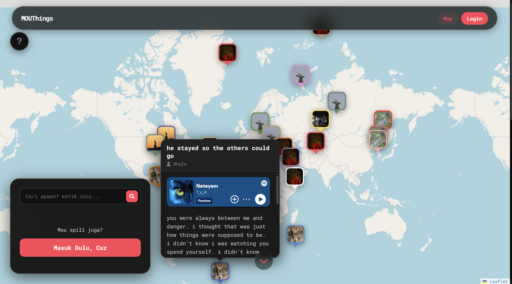
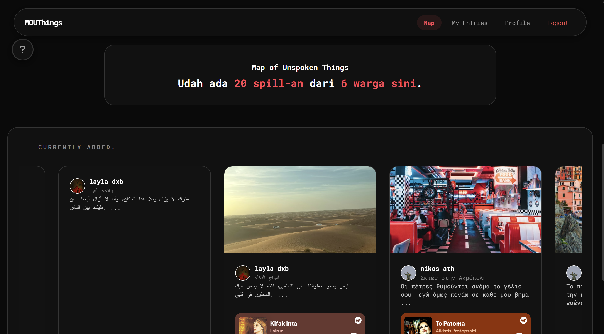
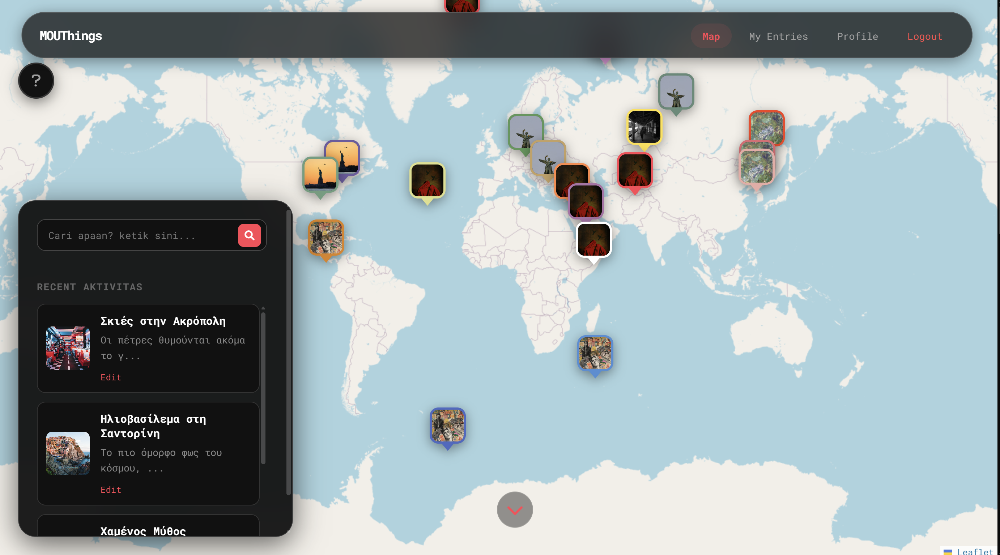
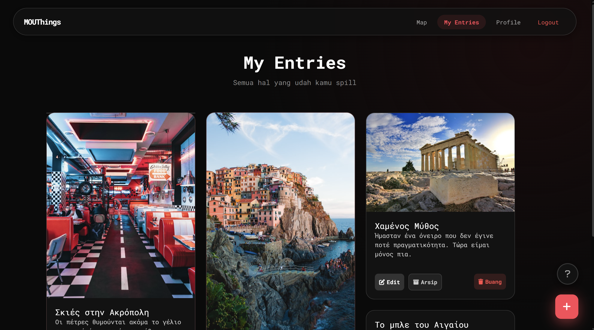
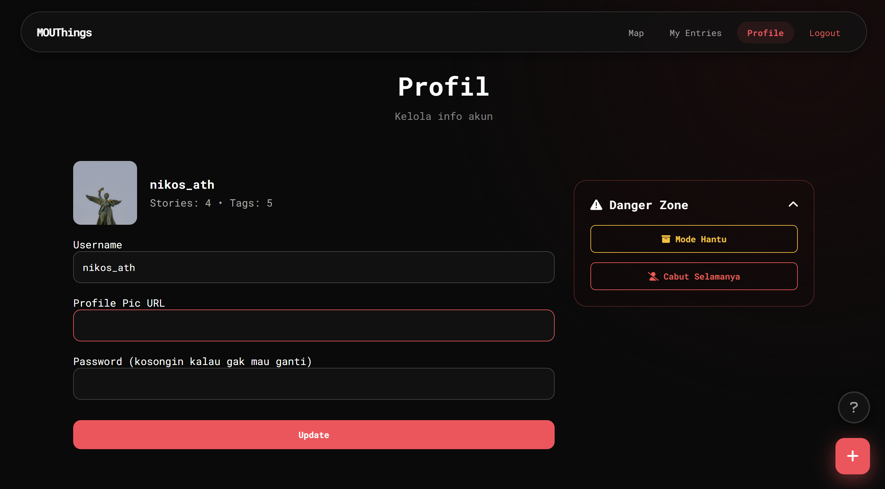

# 📍 Map of Unspoken Things (MOUThings)

**Map of Unspoken Things** adalah aplikasi berbasis web yang memungkinkan pengguna untuk menitipkan pesan atau curhatan secara anonim pada titik koordinat tertentu di peta. Setiap pesan dilengkapi dengan integrasi lagu dari Spotify untuk menambah kesan emosional pada setiap cerita yang tertinggal.

Project ini dideploy menggunakan infrastruktur **Amazon Web Services (AWS)** untuk memenuhi tugas **UAS Cloud Computing**.

---

## 📑 Daftar Isi
1. [📸 Preview Aplikasi](#preview-aplikasi)
2. [📺 Technical Demonstration](#technical-demonstration)
3. [🚀 Fitur Utama](#fitur-utama)
4. [🛠️ Tech Stack](#tech-stack)
5. [👤 User Demo](#user-demo)
6. [☁️ Arsitektur Cloud](#arsitektur-cloud)
7. [⚠️ Disclaimer & Catatan Lab](#disclaimer--catatan-lab)
8. [⚙️ Cara Deployment](#cara-deployment)

---

## 📸 Preview Aplikasi

### Public Access View
| Interactive Map & Spotify | Gallery & Stats |
|:---:|:---:|
|  |  |
| *Visualisasi pin pada peta* | *Galeri 10 pin teratas* |

### Logged-in User View
| Side(floating)bar Fungsional | Entries Gallery | Profile |
|:---:|:---:|:---:|
|  |  |  |
| *Track 5 entri terbaru* | *Manajemen entri user* | *Statistik kontribusi* |

---

## 📺 Technical Demonstration
Lihat demonstrasi teknis verifikasi infrastruktur dan fungsionalitas **MOUThings** pada video di bawah ini:

  
  
<i>Verifikasi CloudFormation, RDS, dan Akses Public DNS EC2 (Klik untuk putar di tab baru)</i>

--- 

## 🚀 Fitur Utama
* **Interactive Map**: Penempatan pin cerita berdasarkan lokasi geografis (Latitude & Longitude).
* **Spotify Integration**: Pemutar musik otomatis berdasarkan track Spotify yang dibagikan.
* **User Statistics**: Ringkasan jumlah cerita dan kontribusi pengguna di halaman profil.
* **Infrastructure as Code**: Deployment otomatis menggunakan AWS CloudFormation.

---

## 🛠️ Tech Stack
* **Backend**: Python 3 (Flask Framework)
* **Frontend**: HTML5, CSS3, JavaScript (Leaflet.js)
* **Database**: PostgreSQL (Amazon RDS)
* **Web Server**: Gunicorn & AWS EC2 (t2.micro)

---

## 👤 User Demo
* **Username**: `user`
* **Password**: `user`

---

## ☁️ Arsitektur Cloud
1. **Amazon EC2**: Application server untuk Flask & Gunicorn.
2. **Amazon RDS (PostgreSQL)**: Managed database service untuk penyimpanan data persisten.
3. **Security Groups**: Konfigurasi firewall untuk port 80, 22, dan 5432.
4. **Automated Provisioning**: Inisialisasi otomatis via **User Data script**.

---

## ⚠️ Disclaimer & Catatan Lab
* **Mobile Optimization**: Aplikasi saat ini dioptimalkan untuk tampilan Desktop.
* **Environment**: Dideploy di **AWS Academy Learner Lab**. IP Public bersifat dinamis dan sesi server terbatas pada durasi lab yang aktif.

---

## ⚙️ Cara Deployment
1. Upload `template.yaml` ke AWS CloudFormation Console.
2. Tunggu status hingga **CREATE_COMPLETE**.
3. Ambil URL akses dari tab **Outputs** CloudFormation.